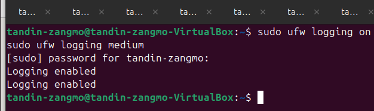
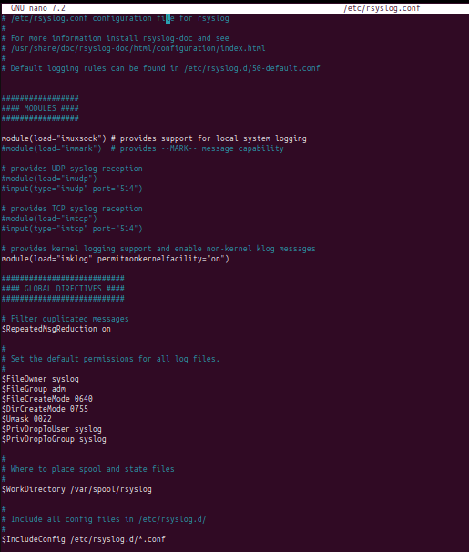
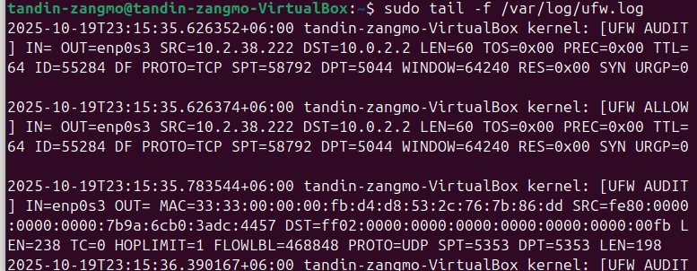
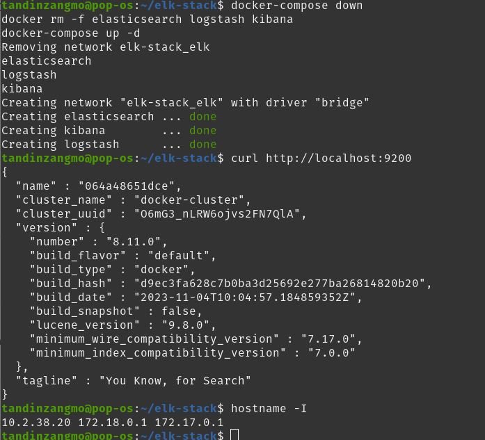
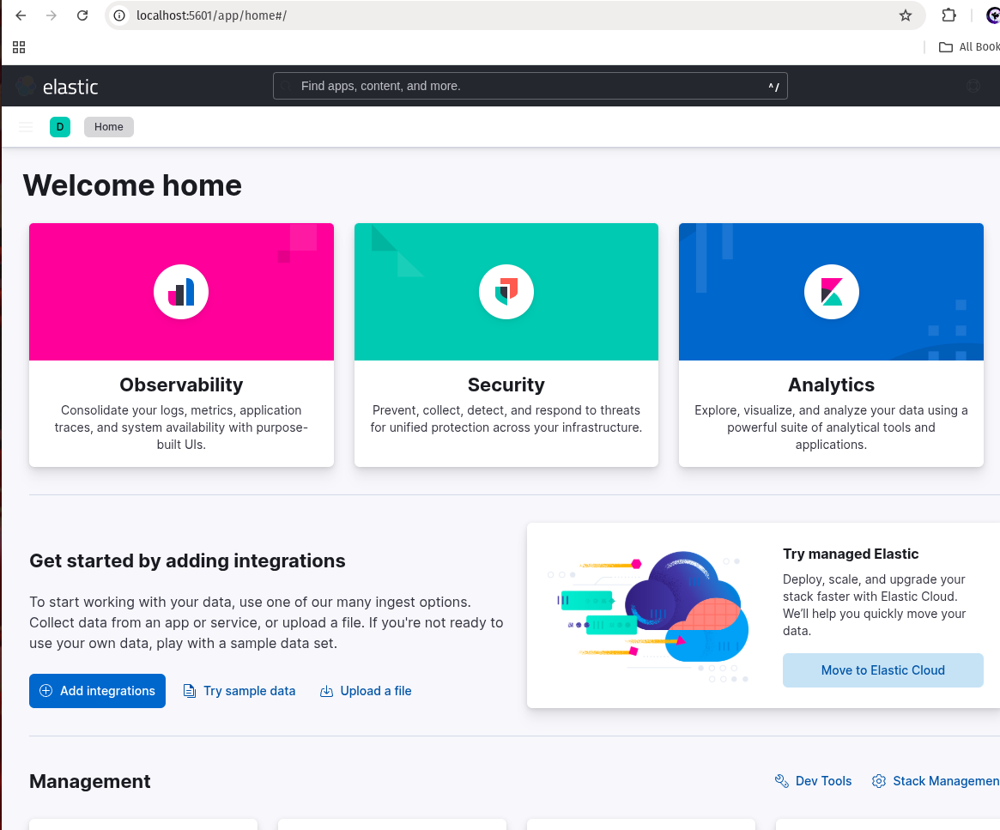
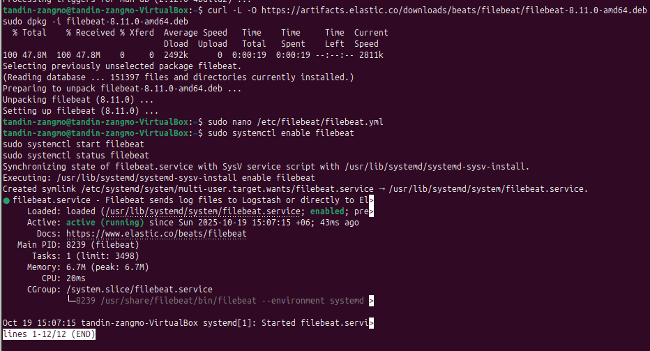

# Report On ELK Stack Security Log Analysis 

## Summary

This assignment covers the experiment of ELK stack in order to monitor security on an Ubuntu VM. I configured the events of log collection in the UFW firewall and authentication and constructed dashboards and threat-hunting activities. The complete functionality of the log ingestion, parsing, visualization, and analysis was achieved, with all the assignment objectives being met.

I had 1,286 events a firewall blocked, and 120 logs of authentication. I developed five visualizations on Firewall Activity dashboard and ten query-threat-hunting queries which identified brute-force attacks, attempts at privilege escalation, port scanning, and indicative patterns of file access.

# Assignment 1: Basic ELK Setup and Log Ingestion

## Phase 1: Log Collection and Configuration

## Task 1.1: Log Source Configuration

### UFW Firewall Configuration
 
I configured the UFW.

```bash
sudo ufw logging on
sudo ufw logging medium
sudo ufw enable
```



### Authentication Logging Setup

I have also enabled detailed auth logs by enabling rsyslog to enable me to log SSH attempts, sudo requests, and other auth related activities.

```bash
sudo nano /etc/rsyslog.conf
# Confirmed: auth,authpriv.*  /var/log/auth.log

sudo systemctl restart rsyslog
sudo tail -5 /var/log/auth.log
```





### ELK Stack Deployment with Docker
I deployed the complete ELK stack on the host machine using Docker Compose.





### Filebeat Installation and Configuration

I installed Filebeat on the Ubuntu VM to ship logs to Logstash.



Configuration:

Inputs: /var/log/auth.log, /var/log/ufw.log
Output: output.logstash.hosts: ["10.0.2.2:5044"]

### Log Ingestion Verification

```bash
sudo systemctl enable filebeat
sudo systemctl start filebeat
sudo systemctl status filebeat
```


## Task 1.2: Logstash Parsing Configuration

### Consolidated Logstash Pipeline
I created a pipeline configuration to parse UFW, authentication, and Snort logs with conditional routing.


```bash
curl http://localhost:9200/_cat/indices?v
```


## Phase 2: Security Dashboards and Visualization
### Task 2.1: Security Dashboard Creation
### Accessing Kibana and Creating Data Views

Navigate to http://localhost:5601 and create data views.
Create data views:

- ufw-logs with pattern ufw-logs-*
- auth-logs with pattern auth-logs-*


### Firewall Activity Dashboard
I developed a comprehensive firewall monitoring dashboard with five visualizations.

### Visualization 1: Top Blocked IP Addresses
Purpose: Identify most frequently blocked source IP addresses.


### Visualization 2: Firewall Log Types
Purpose: Categorize firewall actions by type.


### Visualization 3: Firewall Activity Timeline
Purpose: Monitor temporal patterns to detect attack patterns.


### Visualization 4: Activity Source Distribution
Purpose: Determine event distribution by source.


### Visualization 5: Total Event Count Metric
Purpose: At-a-glance summary of firewall activity.


### Dashboard 2 : Authentication Security Dashboard

Purpose: Monitor authentication attempts, track privilege escalation, and identify suspicious access patterns.


### Task 2.2: Threat Hunting Implementation

Develop operational threat hunting queries using KQL to proactively identify security threats.

1. Brute Force Detection

```bash
event_type: "failed_login" AND src_ip: *
```


Threat Level: HIGH

Multiple failed attempts by using brute force attack or password guessing.

2. Privilege Escalation Monitoring

Find unusual sudo command patterns that might indicate privilege escalation attempts.

event_type: "sudo_command" 

Threat Level: CRITICAL

Attempts to alter user privileges directly or gain access to sensitive authentication information.


3. Port Scanning Detection

This is done via rapid sequential connection requests made to numerous ports.

log_type: "ufw" AND ufw_action: "BLOCK"

Threat Level: HIGH

Port scanning is the initial phase for finding vulnerable services.

4. Suspicious File Access

Monitors sensitive system files that was given access to the attacker.

event_type: "sudo_command" AND (command: "*shadow*")

Threat Level: CRITICAL

If this files which was given access is compromised then all the data are lost.

5. After-Hours Activity

Detect authentication attemptsin irregular hours then it might indicates the system is compromised.

event_type: ("failed_login" OR "successful_login" OR "sudo_command")

Threat Level: MEDIUM to HIGH

Context-dependent - could be valid maintenance or tradeof

6. Multiple Failed Logins Followed by Success

Determine effective brute force attacks where failure was preceded by several failures and successful login.

Threat Level: CRITICAL

This shows a successful brute force attack.

7. Invalid User Enumeration

Detect tries to identify valid usernames by attempting to identify a large number of invalid usernames.

event_type: "invalid_user"

Threat Level: MEDIUM to HIGH

Username enumeration is reconnaissance for targeted attacks.

8. Unusual Protocol Activity

Detects unusual network protocols that shows attacks.

protocol: ("TCP")

Threat Level: MEDIUM

Such protocols may include unusual protocols such as tunneling, C2, and advanced attacks.

9. Geographic Anomalies (if GeoIP configured)

Detect logins from unexpected geographic locations.


event_type: "successful_login" AND src_ip: *

Threat Level: HIGH

Account can be compromise.

10. Repeated Connection to Same Blocked Port

Detect continuous attempts of connecting to a blocked port.

log_type: "ufw" AND ufw_action: "BLOCK" AND dst_port: *

Threat Level: MEDIUM to HIGH

It may be malware beacon, compromised host or C2 traffic.

## Conclusion

The ELK Stack experiment was able to show successful security log collection, visualization, and analysis on an Ubuntu VM. UFW firewall and authentication system logs were ingested, processed and visualized by Filebeat, Logstash, Elasticsearch, and Kibana. The dashboards developed gave a clear view of activity in the system and aided in identifying and knowing the possible threats.

Multiple unusual activities including brute-force attacks, attempts at privilege escalation, and port scanning were detected using ten threat-hunting queries. Altogether, the experiment was quite successful in terms of monitoring, analysis and visualization of security events, which demonstrates that the ELK Stack, in its entirety, is a powerful service to be used in proactive security management of the system.